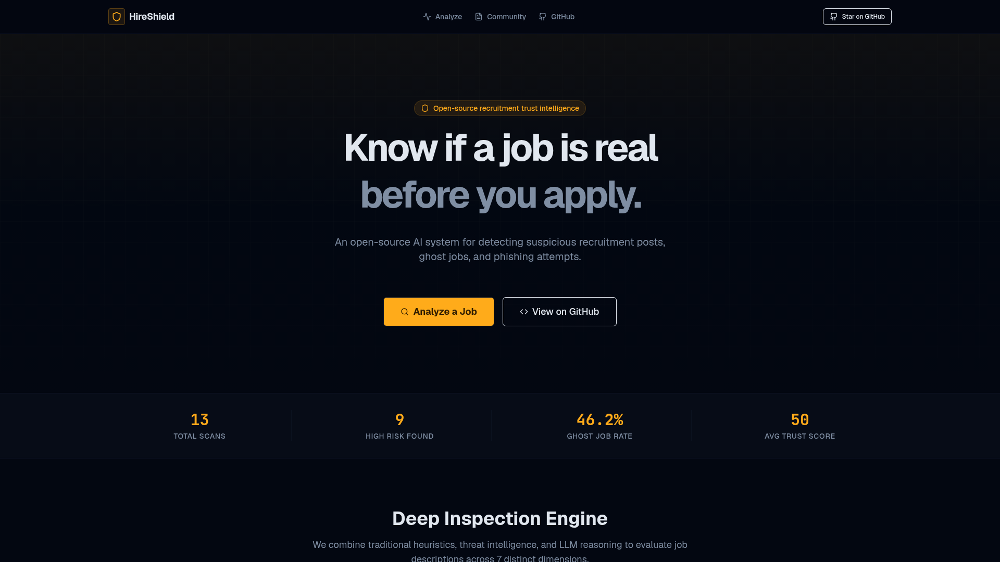

<div align="center">


# HireShield

**Know if a job is real before you apply.**

An open-source AI system that detects suspicious recruitment posts, ghost jobs, and phishing attempts — without ever directly accusing a specific company.

[](https://github.com/gh63/hireshield/actions/workflows/ci.yml)
[](https://hire-shield.replit.app)
[](LICENSE)
[](https://nodejs.org)
[](https://www.typescriptlang.org/)
[](CONTRIBUTING.md)
[](https://github.com/gh63/hireshield/stargazers)
[](https://github.com/gh63/hireshield/releases)

[**Live demo →**](https://hire-shield.replit.app)  ·  [**Documentation →**](https://gh63.github.io/hireshield/)  ·  [**ADRs →**](https://gh63.github.io/hireshield/adr/)

</div>

---

## Why HireShield

Job scams and ghost listings are exploding. Candidates spend hours tailoring applications to roles that were never going to be filled, or worse — hand over personal data to phishing crews posing as recruiters. HireShield gives applicants a fast, transparent **second opinion** on any posting:

- 🧪 **Heuristics-first, LLM-second.** Deterministic NLP signals (urgency markers, suspicious phrasing, stylometry, metadata, duplicate-listing detection) compute the trust score. The LLM only adds qualitative reasoning and a candidate-side summary — it never decides the verdict alone.
- 🧯 **Never accuses.** Output is framed as *trust signals* and *confidence*, not as judgement about a specific employer. We surface evidence and recommended actions.
- 🔗 **Paste text or a URL.** Drop a job description in, or paste a URL — HireShield fetches and parses the posting (with an optional JS-rendering fallback).
- 📊 **Community telemetry.** Aggregated stats across all analyses: risk breakdown, top detected signals, ghost-job share, live feed.

## Demo



> Paste a URL → 7-dimension trust report in seconds. [Try the live demo →](https://hire-shield.replit.app)

<details>
<summary>Landing page screenshot</summary>



</details>

## Features

- **Trust score (0–100)** with a clear risk level — *legitimate · low · medium · high · critical*.
- **Ghost-job probability** based on staleness, churn, and language signals.
- **7-dimension signal report**: suspicious phrases, urgency, stylometry, metadata anomalies, duplicate detection, recruiter-channel checks, and LLM reasoning.
- **Candidate-side summary** — what the role actually offers, in plain English.
- **Recommended actions** — concrete next steps before applying.
- **Shareable permalinks** — every analysis gets a stable URL at `/analyses/:id`.
- **Community page** — telemetry, risk breakdown chart, live feed of recent analyses.
- **Open API** — contract-first OpenAPI spec, generated React Query hooks and Zod validators.

## Stack

| Layer        | Tech                                                                                        |
| ------------ | ------------------------------------------------------------------------------------------- |
| Monorepo     | pnpm workspaces, Node.js 24, TypeScript 5.9                                                 |
| Frontend     | React 19, Vite, wouter, TanStack Query, Tailwind, shadcn/ui, framer-motion, recharts        |
| API          | Express 5, OpenAI SDK (gpt-5.4 via Replit AI Integrations proxy)                            |
| Database     | PostgreSQL + Drizzle ORM                                                                    |
| Validation   | Zod v4, `drizzle-zod`                                                                       |
| API codegen  | Orval (from `lib/api-spec/openapi.yaml`)                                                    |
| URL fetching | Native `fetch` + `cheerio`, with Apify Website Content Crawler as JS-rendered fallback      |

## Repository layout

```
hireshield/
├── artifacts/
│   ├── api-server/         # Express API, mounted at /api
│   ├── hireshield/         # React + Vite frontend, mounted at /
│   └── mockup-sandbox/     # Component preview server (dev only)
├── lib/
│   ├── api-spec/           # OpenAPI spec — single source of truth
│   ├── api-client-react/   # Generated React Query hooks (Orval)
│   ├── db/                 # Drizzle schema + migrations
│   └── nlp-engine/         # Tokenize, tfidf, urgency, stylometry, duplicate-detection
└── scripts/                # Workspace utility scripts
```

## Getting started

### Quick start with Docker (recommended)

The fastest way to try HireShield locally — one command brings up Postgres,
runs the migrations, and serves the app on <http://localhost:8080>.

```bash
git clone https://github.com/gh63/hireshield.git
cd hireshield
cp .env.example .env   # then fill in AI_INTEGRATIONS_OPENAI_*
docker compose up --build
```

What you get:

- `db` — PostgreSQL 16 with a persistent volume
- `migrate` — one-shot job that pushes the Drizzle schema
- `app` — the API server **and** the built React frontend, served on a single port

Stop with `docker compose down` (or `down -v` to wipe the database).

### Manual setup

#### Prerequisites

- **Node.js 24**
- **pnpm 9+** (`corepack enable pnpm`)
- **PostgreSQL 14+** (any provider — Neon, Supabase, local, etc.)
- An **OpenAI-compatible API endpoint** (OpenAI, Azure OpenAI, OpenRouter, a local Ollama with the OpenAI shim, etc.)

### Install

```bash
git clone https://github.com/YOUR_USERNAME/hireshield.git
cd hireshield
pnpm install
```

### Configure

```bash
cp .env.example .env
# then fill in DATABASE_URL and AI_INTEGRATIONS_OPENAI_* in .env
```

See [`.env.example`](.env.example) for the full list of variables. Only `DATABASE_URL` and the two `AI_INTEGRATIONS_OPENAI_*` keys are required.

### Set up the database

```bash
pnpm --filter @workspace/db run push
```

### Run

In two terminals (or two background processes):

```bash
# API at http://localhost:8080
pnpm --filter @workspace/api-server run dev

# Frontend at http://localhost:5173
pnpm --filter @workspace/hireshield run dev
```

Open the frontend URL. The frontend talks to the API on the same origin via `/api/*` — if you run them on different hosts, set up a proxy or adjust the API base URL.

### Typecheck everything

```bash
pnpm run typecheck
```

### Run the tests

```bash
pnpm run test
```

The NLP engine ships with a Vitest suite covering tokenisation, urgency cues,
suspicious-phrase detection, stylometry, metadata heuristics, and the end-to-end
fusion. The suite runs in CI on every PR.

### Regenerate the API client after editing the spec

```bash
pnpm --filter @workspace/api-spec run codegen
```

## How the analyzer works

1. **Input normalization.** Paste-text or URL. URLs go through `fetch-posting.ts` — a simple `fetch + cheerio` extractor first, then an Apify Website Content Crawler fallback if the page is JS-rendered (gated by `APIFY_API_TOKEN`). SSRF guards block private IP ranges; responses are capped at 2 MB and 10 s.
2. **NLP signals** (`lib/nlp-engine`). Deterministic checks produce per-dimension scores: suspicious phrasing, urgency, stylometry anomalies, metadata gaps, duplicate listings across history.
3. **LLM reasoning.** `gpt-5.4` is called via the OpenAI SDK with `response_format: { type: "json_object" }`. It returns a candidate summary, qualitative observations, and a ghost-job probability — but **never sets the trust score directly**.
4. **Fusion.** Signals are weighted into a final trust score and risk level. The LLM output is merged as context, not as a verdict.
5. **Persistence.** Each analysis is stored in `analyses` and gets a permalink at `/analyses/:id`. Aggregates feed the `/community` page.

## Architecture decisions

- **Heuristics-first, LLM-second.** Determinism over hallucination. The score is reproducible.
- **Never accuse.** All copy is framed around evidence and recommendations, not verdicts about specific employers.
- **Contract-first API.** `openapi.yaml` drives both the React Query hooks and the Zod validators. Always regenerate after editing the spec.
- **Path-routed monorepo.** API at `/api/*`, frontend at `/`. Both deploy as a single artifact behind a shared proxy.

## Contributing

PRs are very welcome. See [CONTRIBUTING.md](CONTRIBUTING.md) for setup, conventions, and the codegen workflow. Please also read the [Code of Conduct](CODE_OF_CONDUCT.md).

Good first issues:

- New heuristics in `lib/nlp-engine/src/`
- Additional language support for tokenization
- More extractors in `fetch-posting.ts` (LinkedIn, Indeed, etc.)
- UI polish on `/analyze` and `/community`

## Security

If you find a vulnerability, please **do not** open a public issue. Read [SECURITY.md](SECURITY.md) for the disclosure process.

## License

[MIT](LICENSE) © HireShield contributors.

## Topics

`job-scam-detection` · `ghost-jobs` · `recruitment-fraud` · `phishing-detection` · `nlp` · `openai` · `gpt` · `trust-score` · `typescript` · `react` · `vite` · `express` · `drizzle-orm` · `postgres` · `pnpm-workspace` · `open-source`

---

<div align="center">

If HireShield helped you dodge a scam, star the repo ⭐ — it really helps.

</div>
